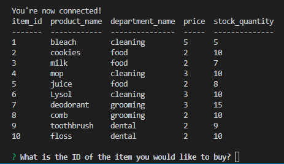
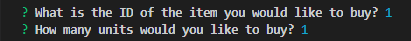
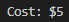
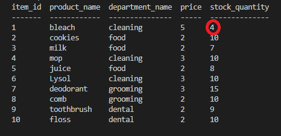
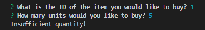

# Bamazon
This app gives the cost of selecting one item from the inventory (the table shown) to the customer.

Upon running the code, the table of inventory will display in the terminal.

Once the table loads, the customer has to select the item of an item_id listed in the table and select how much of that item to purchase.

After the amount of units to buy is specified, the cost of buying that amount of units is displayed.

After the cost is displayed, an updated table will display that shows the change in the amount under "stock_quantity."

However, if the amount of units to buy is more than is listed under "stock_quantity," a message of "Insufficient quantity" will display in the terminal. (The 5 in the below image is going off stock_quantity of bleach in the recently above image.)
